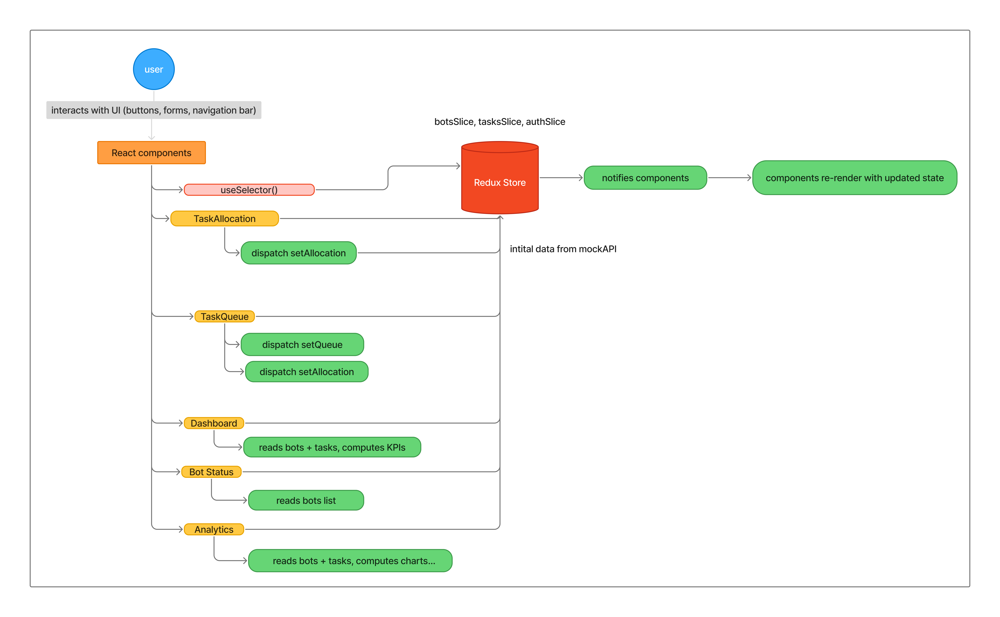

# BOT WAREHOUSE

A web application for monitoring warehouse bots, allocating tasks and visualising system analytics.

## How to run

### 1. Install dependencies
      npm install

### 2. Run the app
      npm run dev     

The frontend will be available at http://localhost:5173.

---

## Tech Stack Used

- **Frontend:** React (Vite)
- **State Management:** Redux Toolkit
- **Routing:** React Router
- **Styling:** Tailwind CSS
- **Charts:** Recharts

---

## Component Architecture

bots-warehouse/
├── warehouse-robot-dashboard/
│   ├── node_modules/
│   ├── public/
│   │   ├── robots.mp4
│   ├── src/
│   │   ├── assets/
│   │   │   └── bg.jpg
│   │   ├── components/
│   │   │   └── Navbar.jsx
│   │   ├── pages/
│   │   │   ├── Analytics.jsx
│   │   │   ├── BotStatus.jsx
│   │   │   ├── Dashboard.jsx
│   │   │   ├── Login.jsx
│   │   │   ├── Map.jsx (for future use)
│   │   │   ├── Signup.jsx
│   │   │   ├── TaskAllocation.jsx
│   │   │   └── TaskQueue.jsx
│   │   ├── store/
│   │   │   ├── authSlice.js
│   │   │   ├── botsSlice.js
│   │   │   ├── tasksSlice.js
│   │   │   └── index.js
│   │   ├── utils/
│   │   │   └── mockApi.js
│   │   ├── App.jsx
│   │   ├── index.css
│   │   └── main.jsx
│   ├── package.json
│   └── README.md 

This project follows a modular and easily scalable component architecture.

All UI layouts are organized into page-level components inside the /pages folder, while reusable UI building blocks like the navigation bar are placed inside /components. Global application state (authentication, bots, tasks) is globally managed inside the /store directory using Redux Toolkit, ensuring predictable data flow across pages. Utility functions and mock APIs are grouped under /utils for clean separation of logic.

---

## Data Flow

User actions in the pages dispatch Redux actions to update bots and tasks, and all views (Dashboard, BotStatus, TaskAllocation, TaskQueue, Analytics) reactively read from the same central store using useSelector.

---

## State Management

I used Redux Toolkit as a central store for bots, tasks, and auth:

- **Single source of truth**  
  Bots and tasks are displayed on multiple pages (Dashboard, Bot Status, Task Allocation, Task Queue, Analytics). Keeping them in a single Redux store avoids prop-drilling and keeps all KPIs and charts in sync.

- **Predictable updates**  
  Actions like `setAllocation` and `setQueue` define exactly how tasks move between "Allocated" and "Queue". This makes the task lifecycle easy to reason about, debug, and extend.

- **Derived views, not duplicated state**  
  Components such as `Dashboard` and `Analytics` don't keep their own copies of data. They derive counts and chart data directly from the shared store with `useSelector`, which reduces bugs from duplicated or out-of-sync state.

- **Separation of concerns via slices**  
  - `botsSlice` – manages robot list and statuses.  
  - `tasksSlice` – manages allocated tasks and the queue.  
  - `authSlice` – manages login/signup state.  
  Each slice focuses on a single domain, keeping reducers and selectors small and readable.

  ---

  ## FIGMA LINK
    https://www.figma.com/design/lXs4HkYfzCbKK6i8L5x5Bp/bots-warehouse?node-id=0-1&t=IZzCQb47QA1u3V3u-1

